# AI Code Reviewer

[![npm version][npm-version-src]][npm-version-href]
[![npm downloads][npm-downloads-src]][npm-downloads-href]
[![License][license-src]][license-href]

一个用于GitLab/GitHub或通用代码托管平台的自动化代码审查工具，旨在提升代码质量，提供智能反馈，并通过灵活配置实现高效的审查流程。

## 特性

- 🤖 **自动代码审查**: 对合并请求和提交进行自动化审查，提供差异分析
- 🧠 **智能反馈**: 通过AI模型提供代码质量评估、最佳实践建议和性能优化建议
- 🔔 **通知集成**: 支持通过GitLab评论和企业微信进行通知
- ⚙️ **灵活配置**: 支持多种AI模型和自定义审查规则，管理配置优先级

## 项目架构

项目采用模块化设计，支持多平台和多AI提供者，核心组件包括：

```mermaid
graph TD
    CLI[CLI入口] --> Config[配置管理]
    CLI --> Platform[平台服务]
    CLI --> AIProvider[AI提供者]
    CLI --> Logger[日志系统]
    CLI --> Core[代码审查核心]
    
    Config --> ENV[环境变量]
    Config --> File[配置文件.aireviewrc.yml]
    Config --> Args[命令行参数]

    Platform --> GitHub[GitHub]
    Platform --> GitLab[GitLab]
    Platform --> Local[本地文件]
    
    GitHub --> PRs[拉取请求]
    GitHub --> Comments[评论]
    GitHub --> Diffs[差异获取]
    
    GitLab --> MRs[合并请求]
    GitLab --> GLComments[评论]
    GitLab --> GLDiffs[差异获取]

    AIProvider --> OpenAI[OpenAI]
    AIProvider --> OpenRouter[OpenRouter]
    AIProvider --> Ollama[Ollama]
    
    OpenAI --> Review[代码审查]
    OpenAI --> Summary[总结生成]
    
    Ollama --> OllamaReview[代码审查]
    Ollama --> OllamaSummary[总结生成]

    Core --> DiffParser[差异解析]
    Core --> FileFilter[文件过滤]
    Core --> Reviewer[审查处理]

    Notification[通知系统] --> WeChat[企业微信]
    Notification --> PlatformComment[平台评论]
    Notification --> FileOutput[文件输出]

    CLI --> Notification
    CLI --> Commands[命令处理]

    Commands --> GithubPR[GitHub PR命令]
    Commands --> GitLabMR[GitLab MR命令]
    Commands --> LocalReview[本地审查命令]
    Commands --> FileReview[单文件审查]
    
    PromptMgr[提示词管理] --> SystemPrompt[系统提示]
    PromptMgr --> ReviewPrompt[审查提示]
    PromptMgr --> SummaryPrompt[总结提示]
    
    Core --> PromptMgr
```



### 主要模块

- **CLI入口**: 处理命令行输入和执行相应操作
- **配置管理**: 处理多来源配置的加载和合并
- **平台服务**: 提供与不同代码托管平台的集成
- **AI提供者**: 封装不同AI服务的调用逻辑
- **通知系统**: 提供多渠道通知能力
- **代码审查核心**: 处理代码差异分析和审查逻辑

## 安装

```bash
# 全局安装
npm install -g @dext7r/ai-code-reviewer

# 或使用pnpm
pnpm add -g @dext7r/ai-code-reviewer

# 或使用yarn
yarn global add @dext7r/ai-code-reviewer
```

## 配置

在项目根目录创建 `.aireviewrc.yml` 文件：

```yaml
# AI模型配置
ai:
  provider: openai # 或 ollama
  model: gpt-4 # 或其他模型

# 平台配置
platform:
  type: gitlab # 或 github
  token: YOUR_TOKEN

# 通知配置
notifications:
  gitlab_comment: true
  wecom:
    enabled: false
    webhook: YOUR_WEBHOOK_URL

# 审查配置（可选）
review:
  # 忽略文件
  ignoreFiles:
    - '*.lock'
    - '*.min.js'
  # 忽略路径
  ignorePaths:
    - node_modules/
    - dist/
  # 自定义提示
  prompts:
    # 系统提示
    system: |
      你是一个专业的代码审查助手，擅长识别代码中的问题并提供改进建议。
    # 审查提示（支持占位符：{{language}}、{{filePath}}、{{diffContent}}）
    review: |
      请审查以下{{language}}代码...
    # 总结提示（支持占位符：{{filesCount}}、{{issuesCount}}、{{resultsSummary}}）
    summary: |
      请总结以下代码审查结果...
```

或使用环境变量：

```bash
export AI_REVIEWER_OPENAI_KEY=your_openai_key
export AI_REVIEWER_GITLAB_TOKEN=your_gitlab_token
```

## 使用方法

### CLI命令

```bash
# 审查GitLab合并请求
ai-review gitlab-mr --project-id 123 --mr-id 456

# 审查GitHub拉取请求
ai-review github-pr --owner user --repo project --pr-id 123

# 审查本地代码
ai-review local --path ./src
```

## 许可证

[MIT](./LICENSE) License

<!-- Badges -->
[npm-version-src]: https://img.shields.io/npm/v/@dext7r/ai-code-reviewer?style=flat&colorA=080f12&colorB=1fa669
[npm-version-href]: https://npmjs.com/package/@dext7r/ai-code-reviewer
[npm-downloads-src]: https://img.shields.io/npm/dm/@dext7r/ai-code-reviewer?style=flat&colorA=080f12&colorB=1fa669
[npm-downloads-href]: https://npmjs.com/package/@dext7r/ai-code-reviewer
[license-src]: https://img.shields.io/github/license/h7ml/ai-code-reviewer.svg?style=flat&colorA=080f12&colorB=1fa669
[license-href]: https://github.com/h7ml/ai-code-reviewer/blob/main/LICENSE
